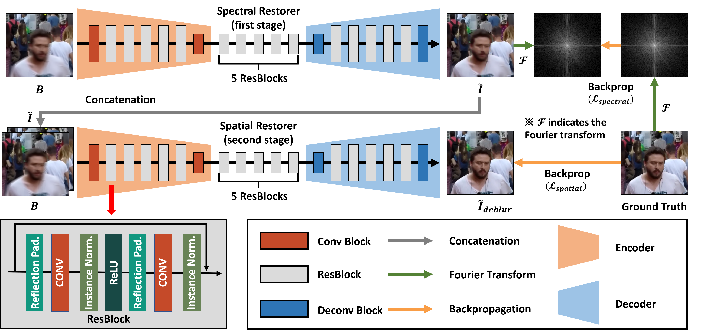
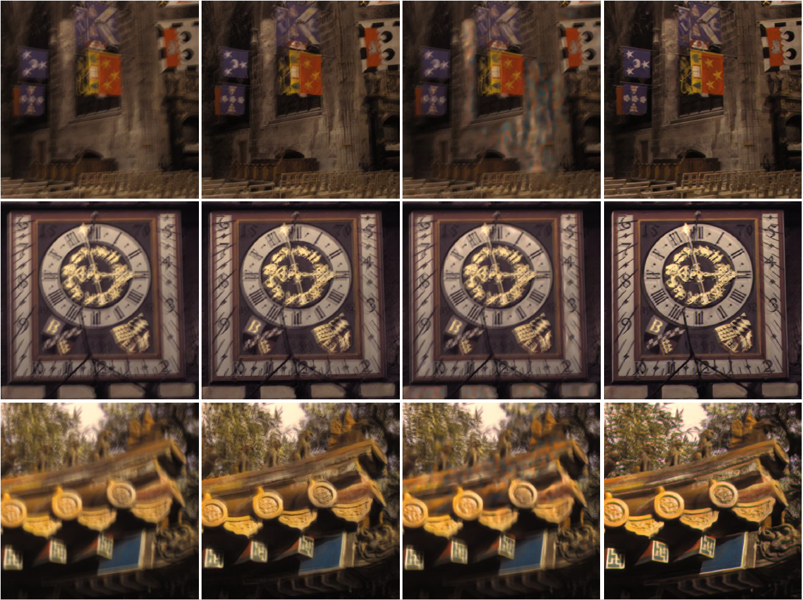

### DSSN_release (we reuploaded the codes after errors are corrected)
This repository is a Pytorch implementation of the paper [**"Deep Spectral-Spatial Network for Single Image Deblurring"**](https://ieeexplore.ieee.org/stamp/stamp.jsp?tp=&arnumber=9094296)

Seokjae Lim, Jin Kim and [Wonjun Kim](https://sites.google.com/site/kudcvlab)  
IEEE Signal Processing Letters

When using this code in your research, please cite the following paper:  

Seokjae Lim, Jin Kim and Wonjun Kim, **"Deep Spectral-Spatial Network for Single Image Deblurring,"** **IEEE Signal Processing Letters** vol. 27, no. 1, pp. 835-839, May 2020.

```  
@ARTICLE{9094296,
author={S. {Lim} and J. {Kim} and W. {Kim}},
journal={IEEE Signal Processing Letters}, 
title={Deep Spectral-Spatial Network for Single Image Deblurring}, 
year={2020},
volume={27},
number={1},
pages={835-839},}
```  
### Model architecture


### Experimental results with state-of-the art methods on the GOPRO dataset

Several results of single image deblurring. First row : input blurry images selected from the GOPRO dataset. Second row : deblurring results by Tao et al. Third row : deblurring result by Zhang et al. Fourth row : deblurring results by the proposed method. Note that blurred regions (red and yellow-colored rectangles) are enlarged for better view. Best views in colors.

### Experimental results with state-of-the art methods on the Köhler dataset

Several results of single image deblurring. First column : input blurry images selected from the Köhler dataset. Second column : deblurring results by Nah et al. Third column : deblurring result by Zhang et al. Fourth column : deblurring results by the proposed method. Note that all experiments are conducted with parameters, which are trained based on the GOPRO dataset, without any modification.

### Requirements

* Python >= 3.5
* Pytorch 0.4.0
* Ubuntu 16.04
* CUDA 8 (if CUDA available)
* cuDNN (if CUDA available)

### Pretrained models
You can download pretrained DSSN model
* [Trained with GOPRO](https://drive.google.com/open?id=1zMUud-FvOjbW9jCpGzvh71p_SL6T_7r0)

### Test result
You can download test results of our DSSN Model
* [Test result with GOPRO](https://drive.google.com/file/d/1i2oreXesUiipnDGsKaRdrB6O-gq_0G-U/view?usp=sharing)

### Note 
1. you should place the weights in the ./data/model/ 
2. Dataset is also placed in the ./data directory  (i.e., ./data/GoPro_Large)
3. test results are saved in the ./data/result/

### Training
* Deep Spectral-Spatial network training
```bash
python main_ULT.py n
```
## Testing 
* Deep Spectral-Spatial network testing
```bash
python main_ULT.py t
```
